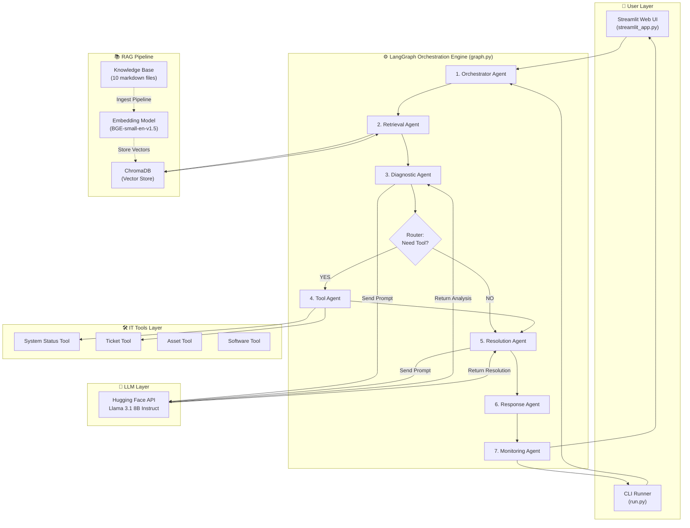
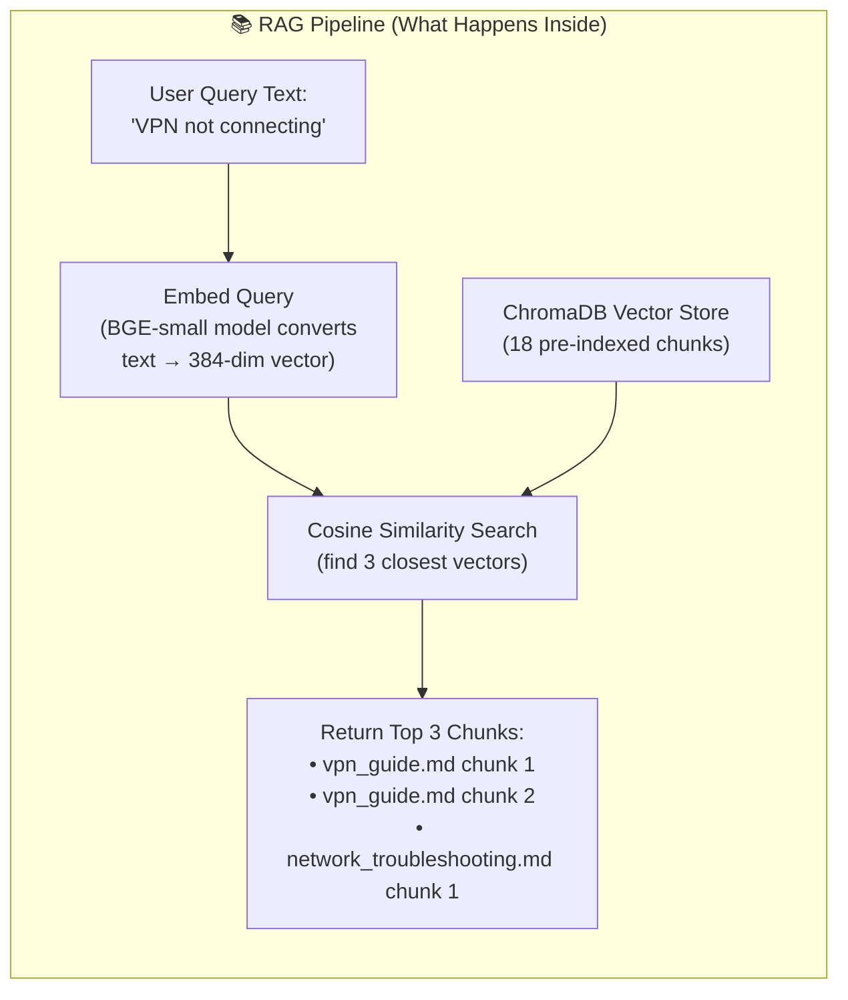
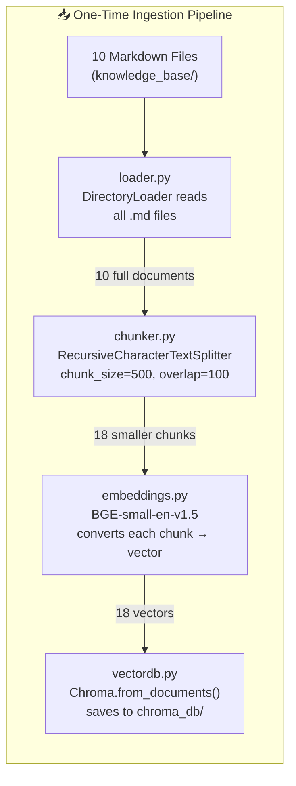
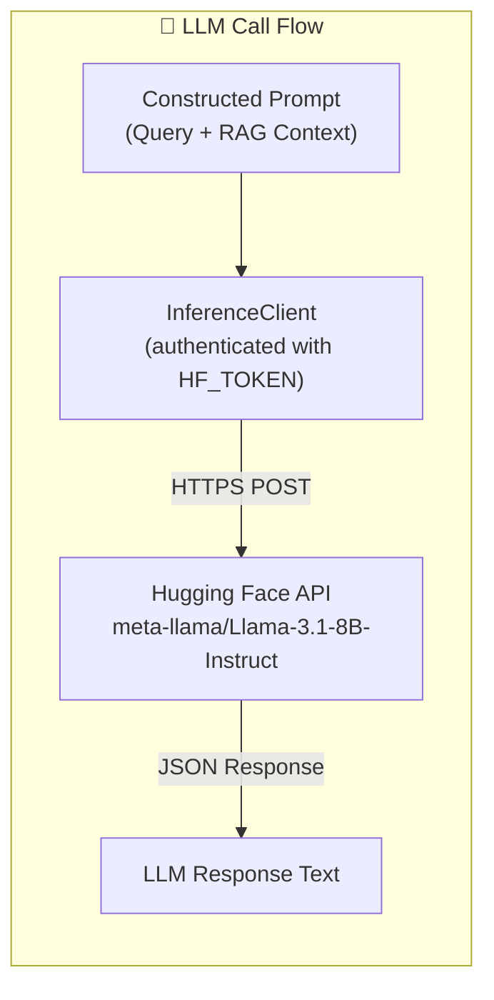
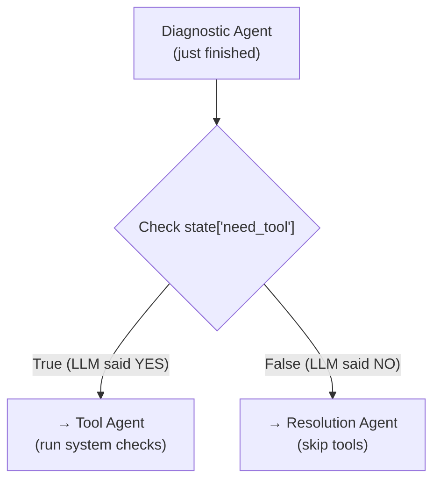
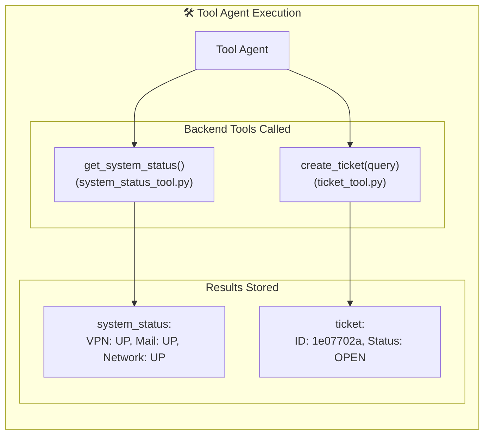
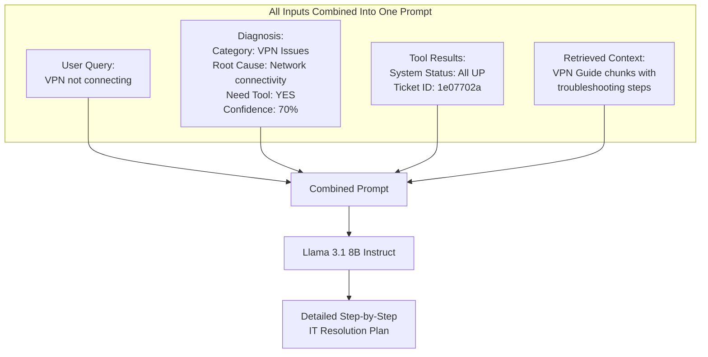
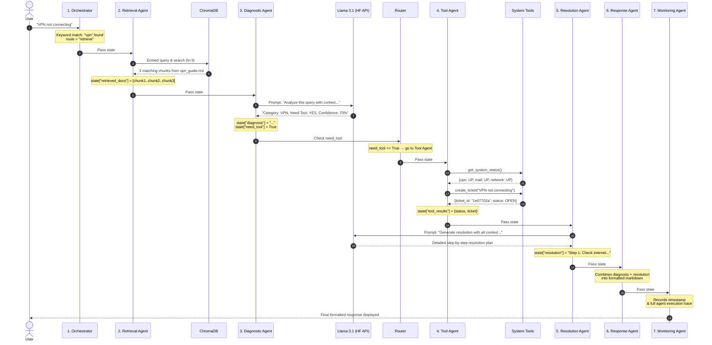

# 🚀 Enterprise IT Operations Copilot — Complete In-Depth Walkthrough

This document explains **every single step** of how this application works — from the moment a user types a query to the final response they see. It includes architecture diagrams, sequence diagrams, data-flow traces, code explanations, and a real execution example.

---

## 📁 Project Structure Overview

```
agentic-it-enterprise-capstone/
│
├── .env                          ← API keys (HF_TOKEN, LangChain config)
├── run.py                        ← CLI entry point (runs the workflow)
├── requirements.txt              ← Python dependencies
│
├── knowledge_base/               ← IT troubleshooting documents (RAG source)
│   ├── vpn_guide.md
│   ├── password_reset.md
│   ├── mfa_setup.md
│   ├── outlook_setup.md
│   ├── network_troubleshooting.md
│   ├── software_installation.md
│   ├── device_onboarding.md
│   ├── access_request.md
│   ├── security_policy.md
│   └── remote_work_policy.md
│
├── chroma_db/                    ← Vector database storage (auto-generated)
│
├── app/
│   ├── llm.py                    ← LLM client (Hugging Face Llama 3.1)
│   │
│   ├── agents/                   ← All 6 agents in the pipeline
│   │   ├── orchestrator.py
│   │   ├── retrieval_agent.py
│   │   ├── diagnostic_agent.py
│   │   ├── tool_agent.py
│   │   ├── resolution_agent.py
│   │   ├── response_agent.py
│   │   └── monitoring_agent.py
│   │
│   ├── rag/                      ← RAG pipeline components
│   │   ├── loader.py             ← Loads .md files from knowledge_base/
│   │   ├── chunker.py            ← Splits documents into small chunks
│   │   ├── embeddings.py         ← Embedding model (BGE-small)
│   │   ├── vectordb.py           ← Creates ChromaDB vector store
│   │   ├── retriever.py          ← Queries ChromaDB for similar docs
│   │   └── ingest.py             ← One-time script to build the DB
│   │
│   ├── tools/                    ← Simulated IT backend tools
│   │   ├── system_status_tool.py
│   │   ├── ticket_tool.py
│   │   ├── asset_tool.py
│   │   └── software_tool.py
│   │
│   ├── workflows/                ← LangGraph workflow definition
│   │   ├── state.py              ← State dictionary schema (TypedDict)
│   │   └── graph.py              ← Agent graph wiring & conditional edges
│   │
│   ├── monitoring/               ← Logging, metrics, evaluation utilities
│   │   ├── logger.py
│   │   ├── metrics.py
│   │   └── evaluator.py
│   │
│   └── ui/
│       └── streamlit_app.py      ← Web UI (Streamlit dashboard)
```

---

## 🏗️ High-Level Architecture Diagram

This is the big picture of how all the pieces connect:



---

## 🔬 The State Object — The Brain of the System

Before we trace the workflow, you need to understand the **state dictionary**. This is the single data object that travels through every agent. Each agent reads from it, modifies it, and passes it forward.

Defined in [state.py](file:///d:/agentic-it-enterprise-capstone/app/workflows/state.py):

```python
class AgentState(TypedDict):
    query: str                    # Original user question
    retrieved_docs: List          # Documents fetched from ChromaDB
    diagnosis: str                # LLM's diagnostic analysis text
    tool_results: Dict[str, Any]  # Results from system tools
    resolution: str               # LLM's resolution plan text
    response: str                 # Final formatted markdown output
    execution_path: List[str]     # Trace of which agents ran
    monitoring: Dict[str, Any]    # Timestamp & audit metadata
    need_tool: bool               # Flag: does the issue need tool execution?
    route: str                    # Routing decision from orchestrator
    error: str                    # Error tracking
```

Here's how the state changes as it passes through each agent:

```mermaid
graph LR
    subgraph INITIAL["Initial State"]
        S0["query = 'VPN not connecting'<br/>retrieved_docs = []<br/>diagnosis = ''<br/>tool_results = {}<br/>resolution = ''<br/>response = ''<br/>execution_path = []<br/>need_tool = False<br/>route = ''"]
    end

    subgraph AFTER_ORC["After Orchestrator"]
        S1["route = 'retrieve'<br/>execution_path = ['orchestrator']"]
    end

    subgraph AFTER_RET["After Retrieval"]
        S2["retrieved_docs = [doc1, doc2, doc3]<br/>execution_path = ['orchestrator', 'retrieval']"]
    end

    subgraph AFTER_DIAG["After Diagnostic"]
        S3["diagnosis = 'Category: VPN...'<br/>need_tool = True<br/>execution_path = [..., 'diagnostic']"]
    end

    subgraph AFTER_TOOL["After Tool"]
        S4["tool_results = {status, ticket}<br/>execution_path = [..., 'tool']"]
    end

    subgraph AFTER_RES["After Resolution"]
        S5["resolution = 'Step 1: Check...'<br/>execution_path = [..., 'resolution']"]
    end

    subgraph AFTER_RESP["After Response"]
        S6["response = '# Diagnosis\n...'<br/>execution_path = [..., 'response']"]
    end

    subgraph AFTER_MON["After Monitoring"]
        S7["monitoring = {timestamp, agents}<br/>execution_path = [..., 'monitoring']"]
    end

    S0 --> S1 --> S2 --> S3 --> S4 --> S5 --> S6 --> S7
```



---

## 🔍 Step-by-Step Deep Dive (With Code)

Now let's trace the exact journey of the query `"VPN not connecting"` through every single component.

---

### STEP 1: User Submits Query

The user types `"VPN not connecting"` either via:
- **CLI** → [run.py](file:///d:/agentic-it-enterprise-capstone/run.py) creates the initial state and calls `graph.invoke(state)`
- **Web UI** → [streamlit_app.py](file:///d:/agentic-it-enterprise-capstone/app/ui/streamlit_app.py) creates the same state on button click

Both call the same compiled LangGraph workflow defined in [graph.py](file:///d:/agentic-it-enterprise-capstone/app/workflows/graph.py).

---

### STEP 2: Orchestrator Agent

**File:** [orchestrator.py](file:///d:/agentic-it-enterprise-capstone/app/agents/orchestrator.py)

**What it does:**
1. Converts the query to lowercase: `"vpn not connecting"`
2. Checks if any known IT keywords appear in the query: `vpn`, `password`, `outlook`, `mfa`, `software`, `network`, `device`, `access`
3. Since `"vpn"` matches → sets `route = "retrieve"` (meaning: go fetch knowledge docs)
4. Logs itself: `execution_path = ["orchestrator"]`

**Code logic:**
```python
keywords = ["vpn", "password", "outlook", "mfa", "software", "network", "device", "access"]
if any(word in query for word in keywords):
    state["route"] = "retrieve"   # ← matched "vpn"
else:
    state["route"] = "direct"     # ← would skip retrieval
```

> [!NOTE]
> The orchestrator is a **keyword-based classifier**. It does NOT use LLM — it's a simple fast-path check to determine if the query is IT-related and needs knowledge retrieval.

---

### STEP 3: Retrieval Agent (RAG — The Knowledge Search)

**File:** [retrieval_agent.py](file:///d:/agentic-it-enterprise-capstone/app/agents/retrieval_agent.py)

This is where the **RAG (Retrieval-Augmented Generation)** pipeline kicks in. Let's break down every sub-step:



#### 3a. How the Knowledge Base Was Pre-Indexed (One-Time Setup)

Before the app can search, the knowledge base must be **ingested** into ChromaDB. This happens via [ingest.py](file:///d:/agentic-it-enterprise-capstone/app/rag/ingest.py):



- **Loader** ([loader.py](file:///d:/agentic-it-enterprise-capstone/app/rag/loader.py)): Uses LangChain's `DirectoryLoader` to read all `.md` files from `knowledge_base/`.
- **Chunker** ([chunker.py](file:///d:/agentic-it-enterprise-capstone/app/rag/chunker.py)): Splits each document into overlapping chunks of max 500 characters (with 100-char overlap so context isn't lost at boundaries). This produced **18 chunks** total.
- **Embeddings** ([embeddings.py](file:///d:/agentic-it-enterprise-capstone/app/rag/embeddings.py)): Each chunk is converted to a **384-dimensional vector** using the `BAAI/bge-small-en-v1.5` sentence-transformer model. This model runs **locally** on your machine.
- **Vector Store** ([vectordb.py](file:///d:/agentic-it-enterprise-capstone/app/rag/vectordb.py)): The vectors + original text are stored in ChromaDB (a local file-based vector database in `chroma_db/`).

#### 3b. At Runtime — Similarity Search

When the retrieval agent runs:
1. The query `"VPN not connecting"` is embedded into a 384-dim vector using the same BGE model
2. ChromaDB compares this vector against all 18 stored chunk vectors using **cosine similarity**
3. The **top 3 most similar chunks** are returned (e.g., chunks from `vpn_guide.md`)
4. These are stored in `state["retrieved_docs"]`

> [!IMPORTANT]
> **Why RAG matters:** Without RAG, the LLM would only use its general training knowledge. With RAG, we inject **your company's specific IT documentation** into the LLM prompt, so it gives answers based on YOUR procedures, not generic advice.

---

### STEP 4: Diagnostic Agent (First LLM Call)

**File:** [diagnostic_agent.py](file:///d:/agentic-it-enterprise-capstone/app/agents/diagnostic_agent.py)

This is the first time the **LLM (Large Language Model)** is called.

#### What happens:

1. A **prompt** is constructed combining the user query + retrieved documents:

```text
You are an enterprise IT support expert.

User Query:
VPN not connecting

Retrieved Context:
[Content from vpn_guide.md chunks about VPN issues, symptoms, resolutions...]

Provide:
1. Category
2. Root Cause
3. Need Tool (YES/NO)
4. Confidence Score
```

2. This prompt is sent to the **Hugging Face Serverless Inference API** via [llm.py](file:///d:/agentic-it-enterprise-capstone/app/llm.py):



3. The LLM responds with structured analysis like:
```
Category: Common VPN Issues
Root Cause: Network connectivity / DNS resolution failure
Need Tool: YES
Confidence Score: 70/100
```

4. The agent checks if `"YES"` appears in the diagnosis text → sets `state["need_tool"] = True`

> [!NOTE]
> **About the LLM:** `Llama 3.1 8B Instruct` is Meta's open-source language model with 8 billion parameters. It runs on Hugging Face's servers (not locally). The `HF_TOKEN` in `.env` authenticates the API request. The `max_tokens=500` parameter limits the response length.

---

### STEP 5: Conditional Routing (LangGraph Decision Point)

**File:** [graph.py](file:///d:/agentic-it-enterprise-capstone/app/workflows/graph.py), lines 67-82

This is where **LangGraph's conditional edges** make a decision:



The routing function is simple:
```python
def route_tools(state):
    if state["need_tool"]:
        return "tool"        # Go to Tool Agent
    return "resolution"      # Skip directly to Resolution Agent
```

In our VPN example, since the LLM said `"Need Tool: YES"`, the flow goes to the **Tool Agent**.

> [!TIP]
> This conditional routing is what makes LangGraph powerful — the workflow is **dynamic**, not fixed. Different queries can take different paths through the agent graph depending on the LLM's analysis.

---

### STEP 6: Tool Agent (System Integration)

**File:** [tool_agent.py](file:///d:/agentic-it-enterprise-capstone/app/agents/tool_agent.py)

This agent calls **simulated backend IT tools** to gather real-time system data:



#### Tool 1: System Status Check ([system_status_tool.py](file:///d:/agentic-it-enterprise-capstone/app/tools/system_status_tool.py))
Returns the current health of infrastructure services:
```python
{"vpn": "UP", "mail": "UP", "network": "UP"}
```

#### Tool 2: Ticket Creation ([ticket_tool.py](file:///d:/agentic-it-enterprise-capstone/app/tools/ticket_tool.py))
Generates a unique support ticket for the issue:
```python
{"ticket_id": "1e07702a", "issue": "VPN not connecting", "status": "OPEN"}
```

#### Other available tools (not used in this flow):
- [asset_tool.py](file:///d:/agentic-it-enterprise-capstone/app/tools/asset_tool.py): Looks up employee device info (Dell Latitude, serial number)
- [software_tool.py](file:///d:/agentic-it-enterprise-capstone/app/tools/software_tool.py): Checks if software is approved (e.g., Zoom → approved, unknown app → not approved)

> [!NOTE]
> These tools are **simulated** with hardcoded responses for demonstration. In a production system, these would connect to real ITSM platforms like ServiceNow, Jira, or network monitoring APIs.

---

### STEP 7: Resolution Agent (Second LLM Call)

**File:** [resolution_agent.py](file:///d:/agentic-it-enterprise-capstone/app/agents/resolution_agent.py)

Now we have ALL the information collected. This agent makes the **second and final LLM call**, combining everything:



The prompt sent to the LLM looks like:
```text
User Query:
VPN not connecting

Diagnosis:
Category: Common VPN Issues
Root Cause: Network connectivity errors
Need Tool: YES
Confidence Score: 70

Tool Results:
{'system_status': {'vpn': 'UP', 'mail': 'UP', 'network': 'UP'},
 'ticket': {'ticket_id': '1e07702a', 'issue': 'VPN not connecting', 'status': 'OPEN'}}

Retrieved Context:
[VPN Troubleshooting Guide content...]

Generate a detailed IT resolution.
```

The LLM returns a comprehensive step-by-step resolution plan (check internet connectivity, restart router, switch networks, verify VPN server, flush DNS, escalation criteria, etc.)

---

### STEP 8: Response Agent (Formatting)

**File:** [response_agent.py](file:///d:/agentic-it-enterprise-capstone/app/agents/response_agent.py)

This is a simple formatting agent — **no LLM call**. It combines the diagnosis and resolution into a clean markdown string:

```python
state["response"] = f"""
# Diagnosis
{state['diagnosis']}

# Resolution
{state['resolution']}
"""
```

---

### STEP 9: Monitoring Agent (Audit & Logging)

**File:** [monitoring_agent.py](file:///d:/agentic-it-enterprise-capstone/app/agents/monitoring_agent.py)

The final agent records metadata for auditing:

```python
state["monitoring"] = {
    "timestamp": 1748846905.123,      # Unix timestamp
    "workflow_status": "success",
    "agents_executed": [
        "orchestrator", "retrieval", "diagnostic",
        "tool", "resolution", "response", "monitoring"
    ]
}
```

After this, the state is returned to the caller (`run.py` or Streamlit UI) and the response is displayed.

---

## 📊 Complete Execution Sequence Diagram

This shows the full timeline of a single query being processed:



---

## 🧩 Summary — Which Technology Does What

| Technology | Role | Where in Code |
|---|---|---|
| **LangGraph** | Defines the agent workflow graph, manages state passing between agents, handles conditional routing | [graph.py](file:///d:/agentic-it-enterprise-capstone/app/workflows/graph.py), [state.py](file:///d:/agentic-it-enterprise-capstone/app/workflows/state.py) |
| **ChromaDB** | Local vector database that stores and searches knowledge base documents by semantic similarity | [vectordb.py](file:///d:/agentic-it-enterprise-capstone/app/rag/vectordb.py), [retriever.py](file:///d:/agentic-it-enterprise-capstone/app/rag/retriever.py) |
| **BGE-small-en-v1.5** | Sentence-transformer embedding model that converts text → 384-dim vectors (runs locally) | [embeddings.py](file:///d:/agentic-it-enterprise-capstone/app/rag/embeddings.py) |
| **Llama 3.1 8B** | Large Language Model that performs diagnosis analysis and generates resolution plans (runs on HF servers) | [llm.py](file:///d:/agentic-it-enterprise-capstone/app/llm.py) |
| **Hugging Face Hub** | API client that authenticates and sends requests to the Llama model | [llm.py](file:///d:/agentic-it-enterprise-capstone/app/llm.py) |
| **RAG Pipeline** | Loader → Chunker → Embedder → Vector Store → Retriever chain for knowledge augmentation | [rag/](file:///d:/agentic-it-enterprise-capstone/app/rag) directory |
| **IT Tools** | Simulated backend services (system monitoring, ticketing, asset lookup, software approval) | [tools/](file:///d:/agentic-it-enterprise-capstone/app/tools) directory |
| **Streamlit** | Web-based UI dashboard for interactive query submission and result visualization | [streamlit_app.py](file:///d:/agentic-it-enterprise-capstone/app/ui/streamlit_app.py) |

---

## 🔑 Key Concepts Explained

### What is RAG (Retrieval-Augmented Generation)?
Instead of relying only on the LLM's training data, RAG **retrieves relevant documents from your own knowledge base** and injects them into the LLM prompt. This means the LLM answers based on **your company's actual IT procedures**, not generic internet knowledge.

### What is LangGraph?
LangGraph is a framework for building **stateful, multi-agent workflows as directed graphs**. Each agent is a "node" in the graph, and "edges" define the execution order. It supports **conditional edges** (if/else branching) so the workflow can dynamically adapt based on the data.

### What is an Agent?
In this project, an "agent" is simply a **Python function** that takes the state dictionary, performs some logic (keyword matching, LLM call, tool call, or formatting), modifies the state, and returns it. The agents are orchestrated by LangGraph.

### What are Embeddings?
Embeddings convert text into **numerical vectors** (lists of numbers). Similar texts produce similar vectors. This allows us to find relevant documents by calculating the mathematical distance between the query vector and document vectors — this is called **semantic similarity search**.
