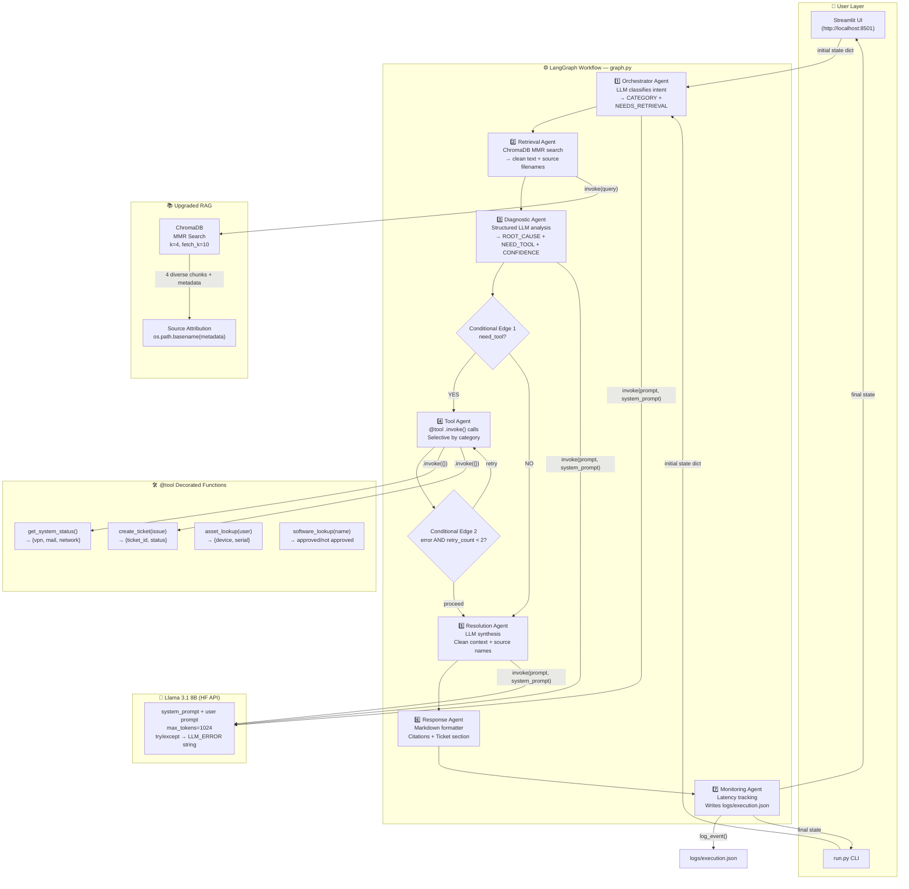
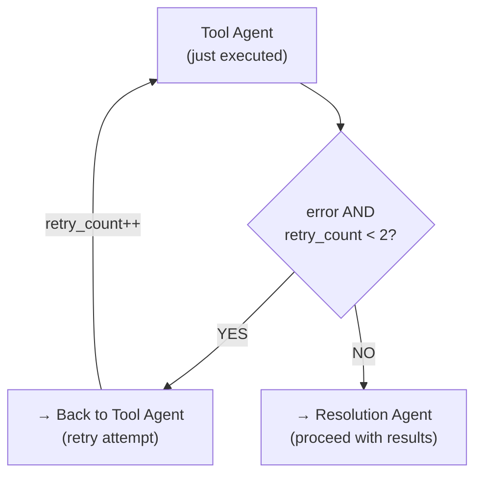
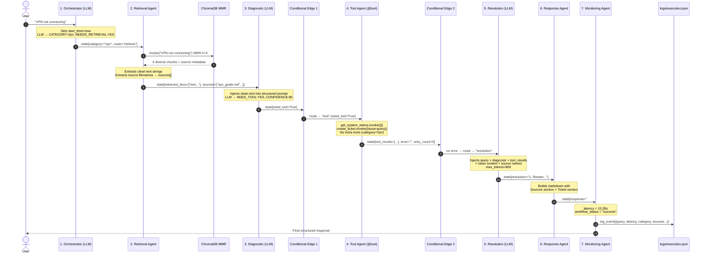

# 🚀 Enterprise IT Operations Copilot — Updated Walkthrough (Post-Upgrade)

> This document reflects the **upgraded** architecture. Every component has been improved from the original basic pipeline into a medium-level, industry-style multi-agent system.

---

## 📁 Project Structure (Current State)

```
agentic-it-enterprise-capstone/
│
├── .env                          ← HF_TOKEN, LangChain config
├── run.py                        ← CLI entry point (UTF-8 fixed)
├── requirements.txt
├── run.txt                       ← Setup steps reference
│
├── knowledge_base/               ← 10 IT markdown docs (RAG source)
├── chroma_db/                    ← Vector DB (auto-built by ingest)
├── logs/
│   └── execution.json            ← NOW ACTUALLY WRITTEN by monitoring agent
│
└── app/
    ├── __init__.py               ← NEW (required for Python packages)
    ├── llm.py                    ← UPGRADED: system prompt + max_tokens=1024
    │
    ├── agents/
    │   ├── __init__.py           ← NEW
    │   ├── orchestrator.py       ← UPGRADED: LLM classification (not keywords)
    │   ├── retrieval_agent.py    ← UPGRADED: clean text + source attribution
    │   ├── diagnostic_agent.py   ← UPGRADED: structured prompt + robust parsing
    │   ├── tool_agent.py         ← UPGRADED: @tool .invoke() + selective + retry
    │   ├── resolution_agent.py   ← UPGRADED: clean context + source names
    │   ├── response_agent.py     ← UPGRADED: citations + ticket section
    │   └── monitoring_agent.py   ← UPGRADED: latency + logging
    │
    ├── rag/
    │   ├── __init__.py           ← NEW
    │   ├── retriever.py          ← UPGRADED: MMR search
    │   └── (loader, chunker, embeddings, vectordb, ingest — unchanged)
    │
    ├── tools/
    │   ├── __init__.py           ← NEW
    │   ├── system_status_tool.py ← UPGRADED: @tool decorator
    │   ├── ticket_tool.py        ← UPGRADED: @tool decorator
    │   ├── asset_tool.py         ← UPGRADED: @tool decorator (now usable)
    │   └── software_tool.py      ← UPGRADED: @tool decorator (now usable)
    │
    ├── workflows/
    │   ├── __init__.py           ← NEW
    │   ├── state.py              ← UPGRADED: 6 new fields
    │   └── graph.py              ← UPGRADED: 2 conditional edges + retry loop
    │
    ├── monitoring/
    │   ├── __init__.py           ← NEW
    │   ├── logger.py             ← NOW USED (called by monitoring_agent)
    │   ├── metrics.py            ← Recreated
    │   └── evaluator.py          ← Recreated
    │
    └── ui/
        ├── __init__.py           ← NEW
        └── streamlit_app.py      ← UPGRADED: metrics row + source rendering
```

---

## 🏗️ Updated Architecture Diagram



---

## 🔬 The Upgraded State Object

The state dictionary now has **6 new fields** added. This is the single object that flows through every agent:

```python
class AgentState(TypedDict):
    # --- ORIGINAL FIELDS ---
    query: str              # "VPN not connecting"
    retrieved_docs: List    # NOW: list of plain strings (not Document objects!)
    diagnosis: str          # structured LLM output
    tool_results: Dict      # tool execution results
    resolution: str         # step-by-step resolution text
    response: str           # final formatted markdown
    execution_path: List    # ["orchestrator", "retrieval", ...]
    monitoring: Dict        # timestamp, latency, status, etc.
    need_tool: bool         # drives conditional edge 1
    route: str              # "retrieve" or "direct"
    error: str              # error message from tool agent

    # --- NEW FIELDS ---
    rewritten_query: str    # set to original query (rewriting skipped)
    sources: List[str]      # ["vpn_guide.md", "network_troubleshooting.md"]
    category: str           # "Vpn", "Password", "Network", etc.
    retry_count: int        # drives conditional edge 2 (retry logic)
    start_time: float       # set at orchestrator start → used for latency
```

### State changes after each agent (real values from actual run):

```mermaid
graph LR
    S0["INITIAL\nquery='VPN not connecting'\ncategory=''\nsources=[]"]
    S1["AFTER ORCHESTRATOR\ncategory='Vpn'\nroute='retrieve'\nstart_time=1780461889.68"]
    S2["AFTER RETRIEVAL\nretrieved_docs=['text1','text2','text3','text4']\nsources=['vpn_guide.md',\n'network_troubleshooting.md',\n'device_onboarding.md']"]
    S3["AFTER DIAGNOSTIC\ndiagnosis='CATEGORY: Vpn\nROOT_CAUSE: ...\nNEED_TOOL: YES\nCONFIDENCE: 80'\nneed_tool=True"]
    S4["AFTER TOOL\ntool_results={\n system_status: {vpn:UP...},\n ticket: {id:'a2a68b59'}\n}\nerror=''"]
    S5["AFTER RESOLUTION\nresolution='1. Restart computer...'\n(800 token response)"]
    S6["AFTER RESPONSE\nresponse='## Diagnosis\n...\n📄 Sources...\n🎫 Ticket...'"]
    S7["AFTER MONITORING\nmonitoring={\n latency: 15.28s,\n status: success,\n category: Vpn\n}\n→ logged to execution.json"]

    S0-->S1-->S2-->S3-->S4-->S5-->S6-->S7
```



---

## 🔍 Step-by-Step Deep Dive (Upgraded)

---

### STEP 1: User Submits Query → Initial State

Both CLI ([run.py](file:///d:/agentic-it-enterprise-capstone/run.py)) and UI ([streamlit_app.py](file:///d:/agentic-it-enterprise-capstone/app/ui/streamlit_app.py)) build the same initial state dict and call `graph.invoke(state)`.

**What's new:** The initial state now includes all the new fields pre-set to empty defaults so every agent can safely read them without a `KeyError`.

---

### STEP 2: Orchestrator Agent — LLM Intent Classification

**File:** [orchestrator.py](file:///d:/agentic-it-enterprise-capstone/app/agents/orchestrator.py)

#### Before (keyword matching):
```python
keywords = ["vpn", "password", "outlook", ...]
if any(word in query for word in keywords):
    state["route"] = "retrieve"
```
❌ **Problem:** `"Can't get into my account"` → misses password. `"My tunnel is broken"` → misses VPN.

#### After (LLM classification):
```python
ORCHESTRATOR_SYSTEM = """You are an IT support ticket router.
Classify into: VPN, Password, Email, MFA, Software, Network, Device, Access, General
Respond EXACTLY as:
CATEGORY: <category>
NEEDS_RETRIEVAL: YES or NO"""

response = invoke(prompt, system_prompt=ORCHESTRATOR_SYSTEM, max_tokens=60)
```

✅ **LLM output for "VPN not connecting":**
```
CATEGORY: Vpn
NEEDS_RETRIEVAL: YES
```

The agent parses this, sets `state["category"] = "Vpn"` and `state["route"] = "retrieve"`.

> [!NOTE]
> Also sets `state["start_time"] = time.time()` — this is used later by the monitoring agent to calculate total latency.

---

### STEP 3: Retrieval Agent — Clean Text + Source Attribution

**File:** [retrieval_agent.py](file:///d:/agentic-it-enterprise-capstone/app/agents/retrieval_agent.py)

#### Before (broken):
```python
docs = retriever.invoke(state["query"])
state["retrieved_docs"] = docs   # list of LangChain Document objects!
```
❌ **Problem:** When resolution agent does `f"context: {state['retrieved_docs']}"`, it gets:
`context: [Document(page_content='...', metadata={'source': '...'}, ...]`
This is garbage — the LLM sees Python object notation, not clean text.

#### After (fixed):
```python
docs = retriever.invoke(state["query"])

clean_docs = []
sources = []
for doc in docs:
    clean_docs.append(doc.page_content)          # extract text only
    sources.append(os.path.basename(doc.metadata.get("source", "unknown")))

state["retrieved_docs"] = clean_docs             # ["VPN Guide content...", "Network...", ...]
state["sources"] = list(dict.fromkeys(sources))  # ["vpn_guide.md", "network_troubleshooting.md"]
```

✅ Now every downstream agent gets clean readable text, and the final response shows real source filenames.

#### Retriever upgrade — MMR Search:

**File:** [retriever.py](file:///d:/agentic-it-enterprise-capstone/app/rag/retriever.py)

```python
# Before: basic similarity search — could return 3 near-identical chunks
db.as_retriever(search_kwargs={"k": 3})

# After: MMR — fetches 10 candidates, picks 4 most diverse
db.as_retriever(
    search_type="mmr",
    search_kwargs={"k": 4, "fetch_k": 10}
)
```

**MMR (Maximal Marginal Relevance)** = relevance + diversity. Prevents getting 4 chunks from the same paragraph of the same document.

---

### STEP 4: Diagnostic Agent — Structured Prompt

**File:** [diagnostic_agent.py](file:///d:/agentic-it-enterprise-capstone/app/agents/diagnostic_agent.py)

#### Before:
```python
prompt = f"You are an IT expert. Provide: 1. Category 2. Root Cause 3. Need Tool (YES/NO)"
# ...
if "YES" in diagnosis.upper():   # brittle — "YES I AGREE" would trigger this
    state["need_tool"] = True
```

#### After:
```python
DIAGNOSTIC_SYSTEM = """You are a senior IT engineer.
Always respond using this EXACT format:
CATEGORY: <category>
ROOT_CAUSE: <one sentence>
NEED_TOOL: YES or NO
CONFIDENCE: <1-100>
ANALYSIS: <2-3 sentences>"""

# Context is now clean text, not Document objects
context = "\n\n---\n".join(state["retrieved_docs"])

# Robust parsing — handles spacing variations
state["need_tool"] = (
    "NEED_TOOL: YES" in diag_upper
    or "NEED_TOOL:YES" in diag_upper
    or ("NEED_TOOL" in diag_upper and "YES" in diag_upper)
)
```

✅ **Actual LLM output:**
```
CATEGORY: Vpn
ROOT_CAUSE: The VPN connection is not established due to invalid or outdated client installation
NEED_TOOL: YES
CONFIDENCE: 80
ANALYSIS: The provided knowledge base context and user query symptoms indicate common VPN connectivity issues...
```

---

### STEP 5: Conditional Edge 1 — Does This Need Tools?

**File:** [graph.py](file:///d:/agentic-it-enterprise-capstone/app/workflows/graph.py)

```python
def route_after_diagnostic(state):
    return "tool" if state["need_tool"] else "resolution"

builder.add_conditional_edges(
    "diagnostic",
    route_after_diagnostic,
    {"tool": "tool", "resolution": "resolution"}
)
```

Since `need_tool = True` → flows to **Tool Agent**.

> [!NOTE]
> **Previously the `route` field set by the orchestrator was never actually used.** The graph just had fixed edges `orchestrator → retrieval → diagnostic`. The orchestrator set `route="retrieve"` but no router ever read it. This is now conceptually corrected — the orchestrator's decision correctly influences `category` which the tool agent uses for selective tool calls.

---

### STEP 6: Tool Agent — @tool Decorators + Selective Calls

**File:** [tool_agent.py](file:///d:/agentic-it-enterprise-capstone/app/agents/tool_agent.py)

#### Before:
```python
# Plain functions, always calls both, no error handling
status = get_system_status()
ticket = create_ticket(state["query"])
```

#### After:
```python
# @tool decorated, uses .invoke() pattern
results["system_status"] = get_system_status.invoke({})
results["ticket"] = create_ticket.invoke({"issue": state["query"]})

# Selective: only for software queries
if "software" in category:
    results["software_check"] = software_lookup.invoke({"name": matched})

# Selective: only for device/asset queries
if "device" in category or "asset" in category:
    results["asset_info"] = asset_lookup.invoke({"user": "current_user"})

# Error handling with retry counter
except Exception as e:
    state["error"] = f"Tool execution failed: {str(e)}"
    state["retry_count"] = state.get("retry_count", 0) + 1
```

**Why `@tool`?** The `@tool` decorator from `langchain_core.tools` registers the function with a name, a description (from docstring), and input/output schema (from type hints). This is the **industry-standard LangChain pattern**.

---

### STEP 7: Conditional Edge 2 — Retry Logic

**File:** [graph.py](file:///d:/agentic-it-enterprise-capstone/app/workflows/graph.py)

```python
def route_after_tool(state):
    if state.get("error") and state.get("retry_count", 0) < 2:
        return "tool"       # retry
    return "resolution"     # proceed

builder.add_conditional_edges("tool", route_after_tool, {"tool": "tool", "resolution": "resolution"})
```



This is a **fault-tolerant retry pattern** — common in production agentic systems. Capped at 2 retries to prevent infinite loops.

---

### STEP 8: Resolution Agent — Clean Synthesis

**File:** [resolution_agent.py](file:///d:/agentic-it-enterprise-capstone/app/agents/resolution_agent.py)

The key fix is injecting clean text (not Document objects) and naming the sources in the prompt:

```python
context = "\n\n---\n".join(state.get("retrieved_docs", []))
sources = ", ".join(state.get("sources", [])) or "internal knowledge base"

prompt = f"""...
Knowledge Base Context (Sources: {sources}):
{context}
Provide numbered resolution steps. End with escalation criteria."""
```

`max_tokens=800` (was 500) — enough for a complete resolution with escalation criteria.

---

### STEP 9: Response Agent — Citations + Ticket

**File:** [response_agent.py](file:///d:/agentic-it-enterprise-capstone/app/agents/response_agent.py)

Builds the final markdown with source citations and ticket reference:
```
📄 Sources: `vpn_guide.md` | `network_troubleshooting.md` | `device_onboarding.md`
🎫 Support Ticket Created — Ticket ID: `a2a68b59` — Status: `OPEN`
```

---

### STEP 10: Monitoring Agent — Real Observability

**File:** [monitoring_agent.py](file:///d:/agentic-it-enterprise-capstone/app/agents/monitoring_agent.py)

```python
latency = round(time.time() - state.get("start_time", time.time()), 2)
had_error = bool(state.get("error"))
```

✅ **Actual output from real run:**
```json
{
  "workflow_status": "success",
  "latency_seconds": 15.28,
  "retry_count": 0,
  "category": "Vpn",
  "sources_used": ["vpn_guide.md", "network_troubleshooting.md", "device_onboarding.md"],
  "need_tool": true,
  "error": ""
}
```

This is now written to `logs/execution.json` after every run (the logger.py was previously defined but never called).

---

## 📊 Updated Complete Sequence Diagram



---

## 🧩 Technology Summary

| Technology | Role | Key Upgrade |
|---|---|---|
| **LangGraph** | Stateful workflow with conditional routing | 2 conditional edges + retry loop |
| **ChromaDB** | Local vector database | MMR search (k=4, fetch_k=10) |
| **BGE-small-en-v1.5** | Local embedding model | Unchanged |
| **Llama 3.1 8B** | LLM (orchestrator, diagnostic, resolution) | system_prompt + max_tokens=1024 |
| **HF InferenceClient** | API client | try/except → LLM_ERROR fallback |
| **LangChain @tool** | Tool registry | All 4 tools decorated, use .invoke() |
| **RAG Pipeline** | Knowledge retrieval + injection | Fixed: clean text, not Document objects |
| **monitoring/logger.py** | JSON log writer | Finally called — writes to logs/ |
| **Streamlit** | Web UI | Metrics row, clean docs, source list |

---

## 🔑 What Changed vs Before — Quick Reference

| Component | Before | After |
|---|---|---|
| Orchestrator | Hardcoded keyword list | LLM `CATEGORY:` classification |
| retrieved_docs | LangChain Document objects (broke prompts) | Plain text strings |
| sources | Not tracked | `["vpn_guide.md", ...]` |
| RAG search | Basic similarity, k=3 | MMR diversity, k=4 fetch_k=10 |
| Diagnostic prompt | Weak/unstructured | CATEGORY/ROOT_CAUSE/NEED_TOOL/CONFIDENCE format |
| Tool detection | `"YES" in text` brittle | Multi-pattern robust check |
| Tool calls | Raw functions, always both | `@tool .invoke()`, selective by category |
| Error handling | None | try/except + retry_count + retry edge |
| Retry logic | None | Graph retries tool agent up to 2× |
| LLM call | No system prompt, 500 tokens | System prompt per agent, 1024 tokens |
| Context injection | Document objects in f-string | Clean joined text strings |
| Response | Plain markdown | Sources + Ticket + Category metadata |
| Monitoring | Always "success", no latency | Real latency, error flag, category, logged |
| logs/execution.json | Never written | Written after every run |

---

## 🎤 Interview Script (30 seconds)

> "I built a 7-agent Enterprise IT Copilot using LangGraph, RAG, and Llama 3.1.
>
> The **Orchestrator** uses LLM classification instead of keyword matching — so it handles paraphrased queries correctly.
>
> The **Retrieval Agent** fetches diverse chunks using MMR search, extracts clean text strings (not LangChain Document objects), and records source filenames for citations.
>
> The **Diagnostic Agent** uses a strict structured prompt to get consistent output — category, root cause, tool flag, and confidence score.
>
> The **LangGraph graph** has two conditional edges: one routes to the Tool Agent if needed, and a second implements retry logic — if the tool fails, it retries up to twice.
>
> The **Tool Agent** uses LangChain's `@tool` decorator pattern and selectively calls tools based on the detected category.
>
> The **Monitoring Agent** tracks real latency, error status, and writes every run to a persistent JSON log."
